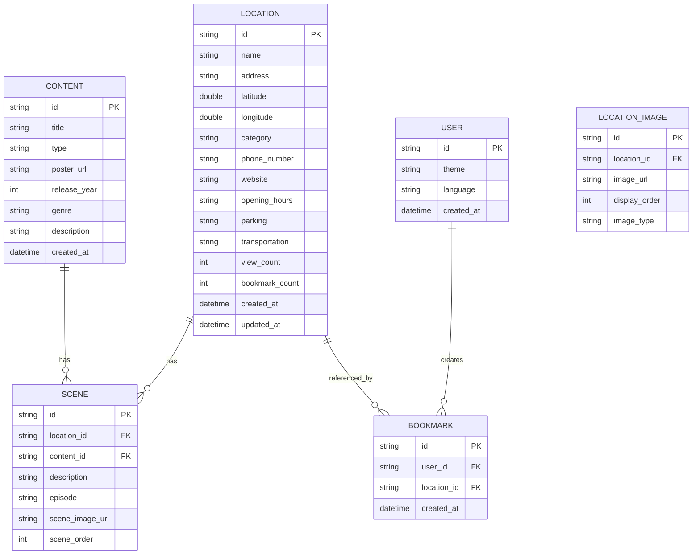

# SceneMap 데이터 모델 설계

## 1. 개요

SceneMap 앱의 데이터 구조를 정의하고, 로컬 데이터베이스(SQLite) 스키마 및 JSON 직렬화 구조를 설계합니다.

---

## 2. 핵심 엔티티

### 2.1 Entity Relationship Diagram (ERD)



---

## 3. 데이터 모델 상세

### 3.1 Location (촬영지)

**목적**: 드라마/영화 촬영지 정보 저장

#### Dart 모델
```dart
import 'package:equatable/equatable.dart';
import 'package:json_annotation/json_annotation.dart';

part 'location.g.dart';

@JsonSerializable()
class Location extends Equatable {
  final String id;
  final String name;
  final String address;
  final double latitude;
  final double longitude;
  final String category;
  final String? phoneNumber;
  final String? website;
  final String? openingHours;
  final List<String> imageUrls;
  final String? parking;
  final String? transportation;
  final int viewCount;
  final int bookmarkCount;
  final DateTime createdAt;
  final DateTime? updatedAt;

  const Location({
    required this.id,
    required this.name,
    required this.address,
    required this.latitude,
    required this.longitude,
    required this.category,
    this.phoneNumber,
    this.website,
    this.openingHours,
    required this.imageUrls,
    this.parking,
    this.transportation,
    this.viewCount = 0,
    this.bookmarkCount = 0,
    required this.createdAt,
    this.updatedAt,
  });

  factory Location.fromJson(Map<String, dynamic> json) => 
      _$LocationFromJson(json);
  
  Map<String, dynamic> toJson() => _$LocationToJson(this);

  @override
  List<Object?> get props => [id];
}
```

#### SQLite 테이블
```sql
CREATE TABLE locations (
  id TEXT PRIMARY KEY,
  name TEXT NOT NULL,
  address TEXT NOT NULL,
  latitude REAL NOT NULL,
  longitude REAL NOT NULL,
  category TEXT NOT NULL,
  phone_number TEXT,
  website TEXT,
  opening_hours TEXT,
  parking TEXT,
  transportation TEXT,
  view_count INTEGER DEFAULT 0,
  bookmark_count INTEGER DEFAULT 0,
  created_at TEXT NOT NULL,
  updated_at TEXT
);

CREATE INDEX idx_locations_category ON locations(category);
CREATE INDEX idx_locations_created_at ON locations(created_at);
```

#### 카테고리 목록
- `cafe`: 카페
- `restaurant`: 식당
- `park`: 공원
- `building`: 건물/랜드마크
- `beach`: 해변
- `street`: 거리/골목
- `school`: 학교
- `other`: 기타

---

### 3.2 LocationImage (촬영지 이미지)

**목적**: 촬영지의 여러 이미지 관리

#### Dart 모델
```dart
@JsonSerializable()
class LocationImage extends Equatable {
  final String id;
  final String locationId;
  final String imageUrl;
  final int displayOrder;
  final String imageType; // 'main', 'gallery', 'scene'

  const LocationImage({
    required this.id,
    required this.locationId,
    required this.imageUrl,
    required this.displayOrder,
    required this.imageType,
  });

  factory LocationImage.fromJson(Map<String, dynamic> json) => 
      _$LocationImageFromJson(json);
  
  Map<String, dynamic> toJson() => _$LocationImageToJson(this);

  @override
  List<Object?> get props => [id];
}
```

#### SQLite 테이블
```sql
CREATE TABLE location_images (
  id TEXT PRIMARY KEY,
  location_id TEXT NOT NULL,
  image_url TEXT NOT NULL,
  display_order INTEGER NOT NULL,
  image_type TEXT NOT NULL,
  FOREIGN KEY (location_id) REFERENCES locations(id) ON DELETE CASCADE
);

CREATE INDEX idx_location_images_location_id ON location_images(location_id);
```

---

### 3.3 Content (드라마/영화)

**목적**: 드라마 및 영화 정보 저장

#### Dart 모델
```dart
@JsonSerializable()
class Content extends Equatable {
  final String id;
  final String title;
  final String type; // 'drama' or 'movie'
  final String? posterUrl;
  final int? releaseYear;
  final String? genre;
  final String? description;
  final DateTime createdAt;

  const Content({
    required this.id,
    required this.title,
    required this.type,
    this.posterUrl,
    this.releaseYear,
    this.genre,
    this.description,
    required this.createdAt,
  });

  factory Content.fromJson(Map<String, dynamic> json) => 
      _$ContentFromJson(json);
  
  Map<String, dynamic> toJson() => _$ContentToJson(this);

  @override
  List<Object?> get props => [id];
}
```

#### SQLite 테이블
```sql
CREATE TABLE contents (
  id TEXT PRIMARY KEY,
  title TEXT NOT NULL,
  type TEXT NOT NULL CHECK(type IN ('drama', 'movie')),
  poster_url TEXT,
  release_year INTEGER,
  genre TEXT,
  description TEXT,
  created_at TEXT NOT NULL
);

CREATE INDEX idx_contents_type ON contents(type);
CREATE INDEX idx_contents_release_year ON contents(release_year);
```

---

### 3.4 Scene (장면)

**목적**: 촬영지와 드라마/영화를 연결하는 장면 정보

#### Dart 모델
```dart
@JsonSerializable()
class Scene extends Equatable {
  final String id;
  final String locationId;
  final String contentId;
  final String description;
  final String? episode;
  final String? sceneImageUrl;
  final int sceneOrder;

  const Scene({
    required this.id,
    required this.locationId,
    required this.contentId,
    required this.description,
    this.episode,
    this.sceneImageUrl,
    this.sceneOrder = 0,
  });

  factory Scene.fromJson(Map<String, dynamic> json) => 
      _$SceneFromJson(json);
  
  Map<String, dynamic> toJson() => _$SceneToJson(this);

  @override
  List<Object?> get props => [id];
}
```

#### SQLite 테이블
```sql
CREATE TABLE scenes (
  id TEXT PRIMARY KEY,
  location_id TEXT NOT NULL,
  content_id TEXT NOT NULL,
  description TEXT NOT NULL,
  episode TEXT,
  scene_image_url TEXT,
  scene_order INTEGER DEFAULT 0,
  FOREIGN KEY (location_id) REFERENCES locations(id) ON DELETE CASCADE,
  FOREIGN KEY (content_id) REFERENCES contents(id) ON DELETE CASCADE
);

CREATE INDEX idx_scenes_location_id ON scenes(location_id);
CREATE INDEX idx_scenes_content_id ON scenes(content_id);
```

---

### 3.5 User (사용자)

**목적**: 사용자 설정 및 정보 저장

#### Dart 모델
```dart
@JsonSerializable()
class User extends Equatable {
  final String id;
  final String theme; // 'light', 'dark', 'system'
  final String language; // 'ko', 'en'
  final DateTime createdAt;

  const User({
    required this.id,
    this.theme = 'system',
    this.language = 'ko',
    required this.createdAt,
  });

  factory User.fromJson(Map<String, dynamic> json) => 
      _$UserFromJson(json);
  
  Map<String, dynamic> toJson() => _$UserToJson(this);

  User copyWith({
    String? theme,
    String? language,
  }) {
    return User(
      id: id,
      theme: theme ?? this.theme,
      language: language ?? this.language,
      createdAt: createdAt,
    );
  }

  @override
  List<Object?> get props => [id];
}
```

#### SQLite 테이블
```sql
CREATE TABLE users (
  id TEXT PRIMARY KEY,
  theme TEXT DEFAULT 'system',
  language TEXT DEFAULT 'ko',
  created_at TEXT NOT NULL
);
```

---

### 3.6 Bookmark (북마크)

**목적**: 사용자가 저장한 촬영지 관리

#### Dart 모델
```dart
@JsonSerializable()
class Bookmark extends Equatable {
  final String id;
  final String userId;
  final String locationId;
  final DateTime createdAt;

  const Bookmark({
    required this.id,
    required this.userId,
    required this.locationId,
    required this.createdAt,
  });

  factory Bookmark.fromJson(Map<String, dynamic> json) => 
      _$BookmarkFromJson(json);
  
  Map<String, dynamic> toJson() => _$BookmarkToJson(this);

  @override
  List<Object?> get props => [id];
}
```

#### SQLite 테이블
```sql
CREATE TABLE bookmarks (
  id TEXT PRIMARY KEY,
  user_id TEXT NOT NULL,
  location_id TEXT NOT NULL,
  created_at TEXT NOT NULL,
  FOREIGN KEY (user_id) REFERENCES users(id) ON DELETE CASCADE,
  FOREIGN KEY (location_id) REFERENCES locations(id) ON DELETE CASCADE,
  UNIQUE(user_id, location_id)
);

CREATE INDEX idx_bookmarks_user_id ON bookmarks(user_id);
CREATE INDEX idx_bookmarks_location_id ON bookmarks(location_id);
```

---

## 4. 복합 모델 (View Models)

### 4.1 LocationDetail

**목적**: 촬영지 상세 화면에서 사용할 통합 데이터

```dart
class LocationDetail extends Equatable {
  final Location location;
  final List<LocationImage> images;
  final List<SceneWithContent> scenes;
  final bool isBookmarked;

  const LocationDetail({
    required this.location,
    required this.images,
    required this.scenes,
    this.isBookmarked = false,
  });

  @override
  List<Object?> get props => [location.id];
}

class SceneWithContent extends Equatable {
  final Scene scene;
  final Content content;

  const SceneWithContent({
    required this.scene,
    required this.content,
  });

  @override
  List<Object?> get props => [scene.id];
}
```

---

## 5. 샘플 데이터 구조

### 5.1 JSON 파일 구조

#### locations.json
```json
[
  {
    "id": "loc_001",
    "name": "인왕산 돌담길",
    "address": "서울특별시 종로구 옥인동",
    "latitude": 37.5876,
    "longitude": 126.9658,
    "category": "street",
    "phoneNumber": null,
    "website": null,
    "openingHours": "24시간",
    "imageUrls": [
      "assets/images/locations/loc_001_1.jpg",
      "assets/images/locations/loc_001_2.jpg"
    ],
    "parking": "주변 공영주차장 이용",
    "transportation": "지하철 3호선 경복궁역 3번 출구에서 도보 15분",
    "viewCount": 1250,
    "bookmarkCount": 340,
    "createdAt": "2024-01-15T10:00:00Z"
  }
]
```

#### contents.json
```json
[
  {
    "id": "content_001",
    "title": "도깨비",
    "type": "drama",
    "posterUrl": "assets/images/contents/goblin_poster.jpg",
    "releaseYear": 2016,
    "genre": "판타지, 로맨스",
    "description": "불멸의 삶을 끝내기 위해 인간 신부가 필요한 도깨비, 그리고 그와 기묘한 동거를 시작한 기억상실증 저승사자",
    "createdAt": "2024-01-15T10:00:00Z"
  }
]
```

#### scenes.json
```json
[
  {
    "id": "scene_001",
    "locationId": "loc_001",
    "contentId": "content_001",
    "description": "은탁이와 도깨비가 처음 만나는 장면",
    "episode": "1회",
    "sceneImageUrl": "assets/images/scenes/scene_001.jpg",
    "sceneOrder": 1
  }
]
```

---

## 6. 데이터베이스 초기화

### 6.1 Database Helper 구조

```dart
class DatabaseHelper {
  static final DatabaseHelper instance = DatabaseHelper._init();
  static Database? _database;

  DatabaseHelper._init();

  Future<Database> get database async {
    if (_database != null) return _database!;
    _database = await _initDB('scenemap.db');
    return _database!;
  }

  Future<Database> _initDB(String filePath) async {
    final dbPath = await getDatabasesPath();
    final path = join(dbPath, filePath);

    return await openDatabase(
      path,
      version: 1,
      onCreate: _createDB,
    );
  }

  Future _createDB(Database db, int version) async {
    // 테이블 생성
    await db.execute('''CREATE TABLE locations (...) ''');
    await db.execute('''CREATE TABLE location_images (...) ''');
    await db.execute('''CREATE TABLE contents (...) ''');
    await db.execute('''CREATE TABLE scenes (...) ''');
    await db.execute('''CREATE TABLE users (...) ''');
    await db.execute('''CREATE TABLE bookmarks (...) ''');
    
    // 인덱스 생성
    // ...
    
    // 초기 데이터 삽입
    await _insertInitialData(db);
  }

  Future _insertInitialData(Database db) async {
    // JSON 파일에서 데이터 로드 및 삽입
  }
}
```

---

## 7. 다음 단계

1. ✅ 데이터 모델 설계 문서 작성 완료
2. 📝 화면 구조 설계 (Wireframe)
3. 💾 실제 Dart 모델 클래스 구현
4. 🗄️ Database Helper 및 Repository 구현
5. 📊 샘플 데이터 준비
