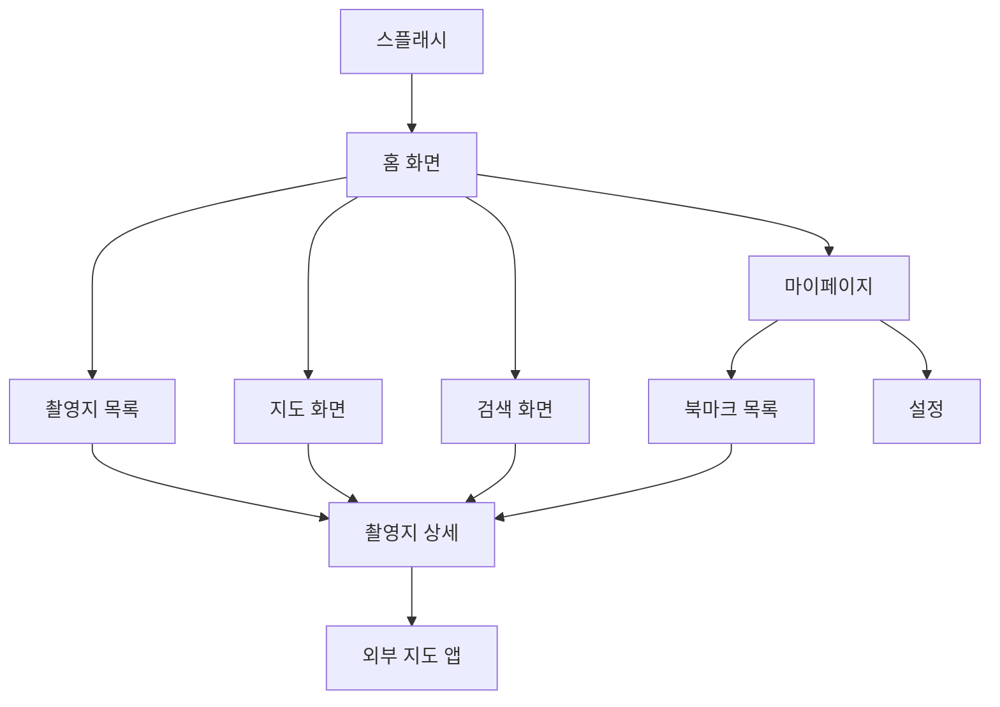

# SceneMap 화면 구조 설계

## 1. 네비게이션 구조

### 1.1 앱 네비게이션 플로우



### 1.2 하단 네비게이션 바

| 아이콘 | 라벨 | 화면 |
|-------|------|------|
| 🏠 | 홈 | 홈 화면 |
| 🗺️ | 지도 | 지도 화면 |
| 🔍 | 검색 | 검색 화면 |
| 👤 | 마이 | 마이페이지 |

---

## 2. 화면별 상세 설계

### 2.1 홈 화면 (Home Screen)

#### 레이아웃 구조
```
┌─────────────────────────────┐
│  SceneMap        🔍 [검색]   │ ← AppBar
├─────────────────────────────┤
│                             │
│  🔥 인기 촬영지              │ ← 섹션 헤더
│  ┌───┐ ┌───┐ ┌───┐         │
│  │img│ │img│ │img│  →      │ ← 수평 스크롤
│  │   │ │   │ │   │         │
│  └───┘ └───┘ └───┘         │
│  촬영지명  촬영지명  촬영지명  │
│  드라마명  드라마명  드라마명  │
│                             │
│  ✨ 최근 추가                │ ← 섹션 헤더
│  ┌─────────────────────┐   │
│  │ [이미지]            │   │ ← 카드
│  │ 촬영지명            │   │
│  │ 드라마명 · 2.3km    │   │
│  └─────────────────────┘   │
│  ┌─────────────────────┐   │
│  │ [이미지]            │   │
│  │ 촬영지명            │   │
│  └─────────────────────┘   │
│                             │
├─────────────────────────────┤
│ 🏠  🗺️  🔍  👤            │ ← 하단 네비게이션
└─────────────────────────────┘
```

#### UI 컴포넌트
- **AppBar**: 타이틀 + 검색 아이콘
- **인기 촬영지 섹션**: 수평 스크롤 카드 리스트
- **최근 추가 섹션**: 수직 스크롤 카드 리스트
- **하단 네비게이션 바**: 4개 탭

#### 상태 관리
- 인기 촬영지 목록 (조회수/북마크 기준 TOP 10)
- 최근 추가 촬영지 목록 (생성일 기준)
- 로딩 상태
- 에러 상태

---

### 2.2 촬영지 목록 화면 (Location List Screen)

#### 레이아웃 구조
```
┌─────────────────────────────┐
│  ← 촬영지 목록    [필터] [정렬]│ ← AppBar
├─────────────────────────────┤
│  [리스트뷰] [그리드뷰]       │ ← 뷰 전환 버튼
├─────────────────────────────┤
│  ┌─────────────────────┐   │
│  │ [이미지]   촬영지명  │   │ ← 리스트 아이템
│  │           드라마명   │   │
│  │           ⭐ 4.5 · 2km│   │
│  │           [♥ 북마크] │   │
│  └─────────────────────┘   │
│  ┌─────────────────────┐   │
│  │ [이미지]   촬영지명  │   │
│  └─────────────────────┘   │
│                             │
├─────────────────────────────┤
│ 🏠  🗺️  🔍  👤            │
└─────────────────────────────┘
```

#### 필터 바텀시트
```
┌─────────────────────────────┐
│  필터                  [적용]│
├─────────────────────────────┤
│  드라마/영화                │
│  ☐ 도깨비                   │
│  ☐ 이태원 클라쓰            │
│                             │
│  지역                       │
│  ☐ 서울                     │
│  ☐ 부산                     │
│  ☐ 제주                     │
│                             │
│  카테고리                   │
│  ☐ 카페                     │
│  ☐ 공원                     │
│  ☐ 건물                     │
│                             │
│  [초기화]           [적용]  │
└─────────────────────────────┘
```

#### 정렬 옵션
- 거리순 (가까운 순)
- 인기순 (조회수 + 북마크)
- 최신순

---

### 2.3 촬영지 상세 화면 (Location Detail Screen)

#### 레이아웃 구조
```
┌─────────────────────────────┐
│  ←              ⋮  [공유]   │ ← AppBar (투명)
├─────────────────────────────┤
│                             │
│  [이미지 캐러셀]            │ ← 스와이프 가능
│  ● ○ ○                      │ ← 인디케이터
│                             │
├─────────────────────────────┤
│  촬영지명                   │ ← 타이틀
│  ⭐ 4.5 (123) · 카페        │ ← 평점 & 카테고리
├─────────────────────────────┤
│  📍 주소                    │
│  서울특별시 종로구...       │
│  [지도 보기]                │
├─────────────────────────────┤
│  🎬 등장 작품                │
│  ┌───────────────────┐     │
│  │ [포스터] 도깨비    │     │
│  │ 1회 - 은탁이와...  │     │
│  └───────────────────┘     │
├─────────────────────────────┤
│  ℹ️ 상세 정보                │
│  📞 02-1234-5678           │
│  🌐 www.example.com        │
│  🕐 10:00 - 22:00          │
│  🅿️ 주차 가능               │
│  🚇 지하철 3호선...         │
├─────────────────────────────┤
│  [길찾기]  [공유]  [♥ 저장] │ ← 고정 하단 버튼
└─────────────────────────────┘
```

#### 주요 기능
- 이미지 갤러리 (스와이프)
- 관련 드라마/영화 정보
- 지도 미리보기 (탭 시 전체 지도 화면)
- 외부 지도 앱 연동 (길찾기)
- 공유 기능
- 북마크 토글

---

### 2.4 지도 화면 (Map Screen)

#### 레이아웃 구조
```
┌─────────────────────────────┐
│  지도              [필터]    │ ← AppBar
├─────────────────────────────┤
│                             │
│         📍                  │
│    📍        📍             │ ← 지도 + 마커
│              📍             │
│                             │
│         [현재 위치] ⊕       │ ← 플로팅 버튼
│                             │
├─────────────────────────────┤
│  ┌─────────────────────┐   │
│  │ [이미지] 촬영지명    │   │ ← 바텀시트
│  │ 드라마명 · 2.3km    │   │   (마커 클릭 시)
│  │ [상세보기]          │   │
│  └─────────────────────┘   │
├─────────────────────────────┤
│ 🏠  🗺️  🔍  👤            │
└─────────────────────────────┘
```

#### 주요 기능
- 촬영지 마커 표시
- 현재 위치 표시
- 마커 클릭 시 바텀시트
- 지도 확대/축소
- 필터 적용

---

### 2.5 검색 화면 (Search Screen)

#### 레이아웃 구조
```
┌─────────────────────────────┐
│  [검색어 입력]        [취소]│ ← 검색 바
├─────────────────────────────┤
│  최근 검색어                │
│  도깨비 ✕                   │
│  인왕산 ✕                   │
│  [전체 삭제]                │
├─────────────────────────────┤
│  인기 검색어                │
│  1. 도깨비                  │
│  2. 이태원 클라쓰           │
│  3. 부산                    │
└─────────────────────────────┘

// 검색 결과 화면
┌─────────────────────────────┐
│  ← "도깨비" 검색 결과       │
├─────────────────────────────┤
│  촬영지 (12)                │
│  ┌─────────────────────┐   │
│  │ [이미지] 촬영지명    │   │
│  └─────────────────────┘   │
│                             │
│  드라마/영화 (1)            │
│  ┌─────────────────────┐   │
│  │ [포스터] 도깨비      │   │
│  └─────────────────────┘   │
└─────────────────────────────┘
```

#### 검색 타입
- 통합 검색 (촬영지 + 드라마/영화)
- 자동완성 (선택사항)
- 최근 검색어 저장

---

### 2.6 마이페이지 (My Page Screen)

#### 레이아웃 구조
```
┌─────────────────────────────┐
│  마이페이지                 │ ← AppBar
├─────────────────────────────┤
│  👤                         │
│  사용자                     │ ← 프로필 (간단)
├─────────────────────────────┤
│  ♥ 북마크 (12)       →     │
│  📊 방문 기록 (5)     →     │ ← 메뉴 리스트
├─────────────────────────────┤
│  설정                       │
│  🎨 테마 설정         →     │
│  🌐 언어 설정         →     │
│  🔔 알림 설정         →     │
├─────────────────────────────┤
│  앱 정보                    │
│  ℹ️ 버전 정보         →     │
│  📄 이용약관          →     │
│  🔒 개인정보 처리방침  →     │
├─────────────────────────────┤
│ 🏠  🗺️  🔍  👤            │
└─────────────────────────────┘
```

---

### 2.7 북마크 목록 화면

#### 레이아웃 구조
```
┌─────────────────────────────┐
│  ← 북마크                   │
├─────────────────────────────┤
│  ┌─────────────────────┐   │
│  │ [이미지]   촬영지명  │   │
│  │           드라마명   │   │
│  │           [♥ 해제]   │   │
│  └─────────────────────┘   │
│  ┌─────────────────────┐   │
│  │ [이미지]   촬영지명  │   │
│  └─────────────────────┘   │
│                             │
└─────────────────────────────┘
```

---

## 3. 공통 UI 컴포넌트

### 3.1 LocationCard (촬영지 카드)
- 이미지 (16:9 비율)
- 촬영지명 (볼드)
- 드라마명 (서브텍스트)
- 거리 정보
- 북마크 아이콘

### 3.2 ContentCard (드라마/영화 카드)
- 포스터 이미지 (2:3 비율)
- 작품명
- 연도 & 장르

### 3.3 EmptyState (빈 상태)
- 아이콘
- 메시지
- 액션 버튼 (선택사항)

### 3.4 LoadingIndicator
- CircularProgressIndicator
- 중앙 정렬

### 3.5 ErrorView
- 에러 아이콘
- 에러 메시지
- 재시도 버튼

---

## 4. 라우팅 구조

### 4.1 GoRouter 설정

```dart
final router = GoRouter(
  routes: [
    GoRoute(
      path: '/',
      builder: (context, state) => const MainScreen(),
    ),
    GoRoute(
      path: '/location/:id',
      builder: (context, state) {
        final id = state.pathParameters['id']!;
        return LocationDetailScreen(locationId: id);
      },
    ),
    GoRoute(
      path: '/search',
      builder: (context, state) => const SearchScreen(),
    ),
    GoRoute(
      path: '/bookmarks',
      builder: (context, state) => const BookmarkListScreen(),
    ),
    GoRoute(
      path: '/settings',
      builder: (context, state) => const SettingsScreen(),
    ),
  ],
);
```

---

## 5. 반응형 디자인 고려사항

### 5.1 화면 크기별 레이아웃
- **모바일 (< 600px)**: 단일 컬럼, 하단 네비게이션
- **태블릿 (≥ 600px)**: 2컬럼 그리드, 측면 네비게이션 (선택사항)

### 5.2 가로/세로 모드
- 세로: 기본 레이아웃
- 가로: 지도 화면 최적화

---

## 6. 접근성 (Accessibility)

- Semantic 위젯 사용
- 충분한 터치 영역 (최소 48x48)
- 색상 대비 비율 준수 (WCAG AA)
- 스크린 리더 지원

---

## 7. 다음 단계

1. ✅ 화면 구조 설계 완료
2. 💾 데이터 모델 구현 (Stage 2)
3. 🎨 실제 UI 구현 (Stage 4)
